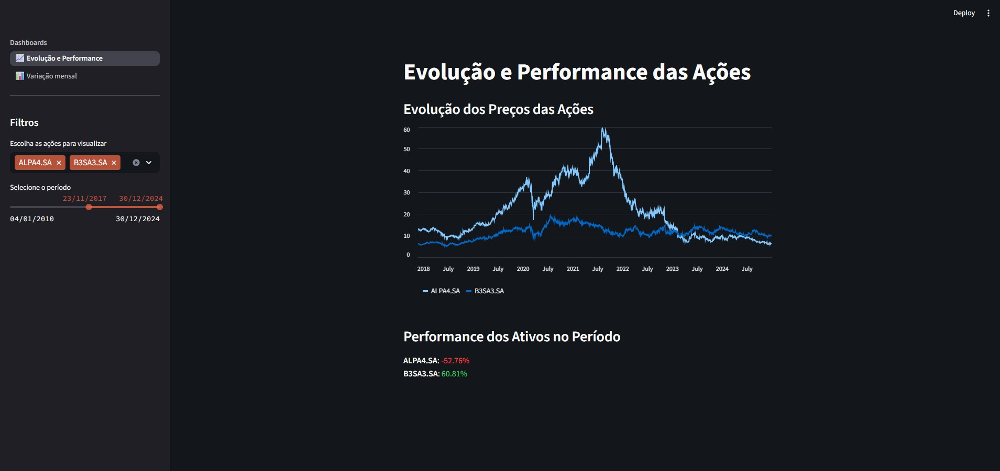
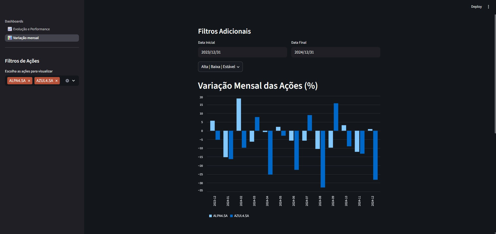

# Analisador de Ações com Streamlit

## 📖 Sobre o Projeto

Este é um aplicativo web interativo, construído com a biblioteca Streamlit em Python, para a análise de ações do mercado financeiro. O projeto permite a visualização de dados históricos e a análise de performance de ativos, focando em ações que compõem o índice Ibovespa.

A aplicação é dividida em duas páginas principais:

1. Evolução e Performance: Um dashboard para visualizar e comparar a evolução do preço de fechamento histórico de múltiplas ações.


2. Variação Mensal: Uma ferramenta para analisar a variação percentual mensal dos ativos, permitindo identificar meses de alta, baixa ou estabilidade.


## ✨ Funcionalidades

- **Visualização de Preços Históricos**: Gráficos de linha interativos que mostram a evolução dos preços das ações desde 2010.
- **Análise de Performance**: Cálculo do retorno total de cada ativo dentro de um período selecionado.
- **Variação Mensal**: Gráficos de barra para comparar a rentabilidade mensal entre diferentes ações.
- **Filtros Dinâmicos**:
  - Seleção múltipla de ações na barra lateral.
  - Filtro por intervalo de datas com seletores de calendário.
  - Filtro por tipo de variação (altas, baixas ou meses estáveis).
- **Interface Amigável**: Construído com componentes Streamlit para uma experiência de usuário limpa e intuitiva.
- **Dados em Tempo Real**: Dados baixados diretamente do Yahoo Finance usando a biblioteca `yfinance`.


## 🚀 Estrutura de Arquivos e Código

```bash
PROJETO_STREAMLIT/
├── .streamlit/
│   └── config.toml        # Temas e Configurações
├── app.py                 # Controlador de navegação
├── page_1.py              # Página de Evolução e Performance
├── page_2.py              # Página de Variação Mensal
├── IBOV.csv               # Base CSV com nome das ações
└── README.md
```

**Criado por:** Fabio Cerqueira Jeronymo  
💼 Estudante de Ciência da Computação | Foco em BI, SQL, Power BI, Python  

Projeto desenvolvido como parte de um estudo sobre análise de dados e desenvolvimento web com Python e Streamlit.
